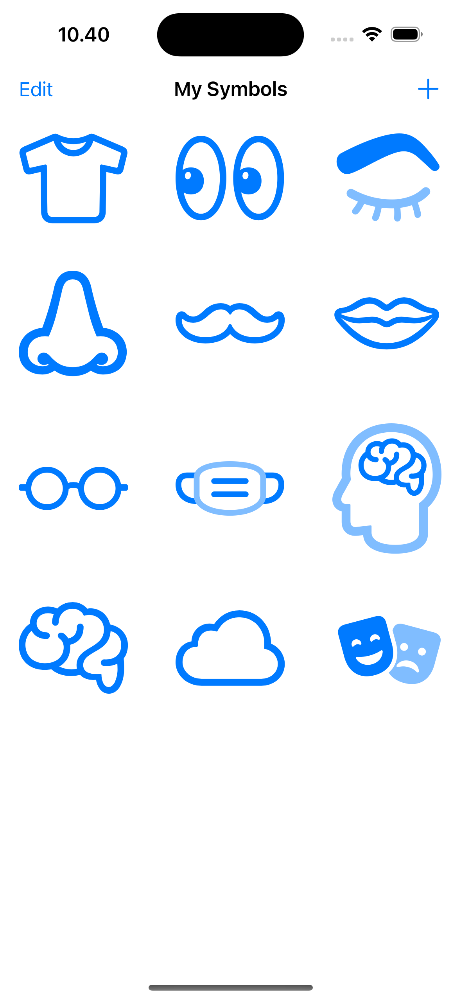

# Swift-Project
## AboutMe

## ChooseYourOwnStory

## DatePlanner

## OrganizingWithGrids

## EditingGrids

## ImageGallery

## LayingOutViews

## MemeCreator

## BubbleLevel

## Seismometer

## RecognizingGestures

## AnimatingShapes

## CapturingPhotos
